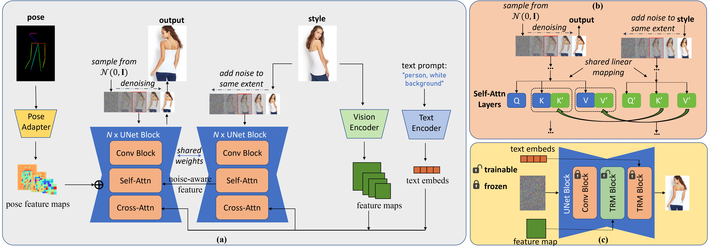

# DNAF: Diffusion with Noise-Aware Feature For Pose-Guided Person Image Synthesis (ICME 2024)

## Results

From left to right are: pose input, source input, ground truth results, ADGAN results, PISE results, GFLA results, DPTN results, CASD results, NTED results, PIDM results, Ours. 

Our generated samples [DNAF_DeepFashion_results](https://drive.google.com/file/d/1YlvrrQUoZ_vW5ggGdKb7fK85gBMHOh9X/view?usp=share_link) and comparison with other state-of-the-art methods [DNAF_vs_others](https://drive.google.com/file/d/1pRuYxbCDvx2w7gNfggO1Zpo_m78v3UbT/view?usp=share_link) are available for evaluation.


The following observations can be made that our model is able to: 

1) adeptly handle the structural conditions and successfully recognize special re- quirements(e.g.flat garment);
2) produce more stable texture and stripes;
3) make more reasonable inference even for the unseen parts;
4) obtain greater resemblance with fewer broken details. 


We also conduct experiments on Market-1501 datasets, which is a challenging dataset with low-resolution street person images. Our generated results [DNAF_Market_results](https://drive.google.com/file/d/1C51fN5Yh4rVl8MgPDS0G_iND2_BK7uC5/view?usp=share_link) can be downloaded for evaluation and comparison.


Further more, our model is capable of a series of downstream applications without extra fine-tuning:

1) Apperance transfer. Our model is capble of modifying the fashion style of a reference image while preserving other elements, making it ideal for virtual try-on applications. With the cloth mask provided, during the inference process, at each diffusion step, we only preseve the masked part and replace the other region with the original image. 
2) Artwork Creation. Our model can also be applied to wild images and other forms of artwork. By replacing the style reference with artwork or a realistic photograph that may not necessarily feature a human subject, the model can easily copy the style and facilitate the generation of creative person images. This capability can be particularly beneficial for de- signers seeking inspiration.

## Method


Our DNAF framework for pose-guided person image synthesis. (a) Architecture overview. (b) At each timestep, we first add the Gaussian noise to the style reference image by respective noise schedule and then send it to the UNet denoiser to extract the intermediate K and V values in all self-attention layers as noise-aware features. (c) A trainable layer is inserted into each UNet block to accept the constant multi-scale feature of style reference image for a basic alignment.

For more etails please refer to your paper.

## TODO
* Once the paper is published, we will release the model and training code.

## Data Preparation
We evaluated our model on two public available dataset: DeepFashion and Market-1501. Moreover, we need to render the openpose extraced keypoints to skeleton-style pose map.

### DeepFashion

The DeepFash- ion dataset contains 52,172 high-resolution images of fash- ion models. Following previous works, we split the dataset into training set of 101,966 pairs and test set of 8,570 pairs. 
- Download `img_highres.zip` of the DeepFashion Dataset from [In-shop Clothes Retrieval Benchmark](https://drive.google.com/drive/folders/0B7EVK8r0v71pYkd5TzBiclMzR00). 

- Unzip `img_highres.zip`. You will need to ask for password from the [dataset maintainers](http://mmlab.ie.cuhk.edu.hk/projects/DeepFashion/InShopRetrieval.html). Then rename the obtained folder as **img** and put it under the `./dataset/deepfashion` directory. 

- We split the train/test set following [GFLA](https://github.com/RenYurui/Global-Flow-Local-Attention). Several images with significant occlusions are removed from the training set. Download the train/test pairs and the keypoints `pose.zip` extracted with [Openpose](https://github.com/CMU-Perceptual-Computing-Lab/openpose) by downloading the following files:

<!--   ```bash
  cd scripts
  ./download_dataset.sh
  ```

  Or you can download these files manually： -->

  - Download the train/test pairs from [Google Drive](https://drive.google.com/drive/folders/1PhnaFNg9zxMZM-ccJAzLIt2iqWFRzXSw?usp=sharing) including **train_pairs.txt**, **test_pairs.txt**, **train.lst**, **test.lst**. Put these files under the  `./dataset/deepfashion` directory. 
  - Download the keypoints `pose.rar` extracted with Openpose from [Google Driven](https://drive.google.com/file/d/1waNzq-deGBKATXMU9JzMDWdGsF4YkcW_/view?usp=sharing). Unzip and put the obtained floder under the  `./dataset/deepfashion` directory.


### Market-1501
The Market-1501 dataset is another important benchmark in the context of person re-identification. It consists of 32,668 low-resolution images captured in a street-style scenario. Training set con- tains 263,632 pairs while test set contains 12,000 pairs, and the identities for training and test does not overlap.

- Download the Market-1501 dataset from [here](http://www.liangzheng.com.cn/Project/project_reid.html). Rename **bounding_box_train** and **bounding_box_test** to **train** and **test**, and put them under the ```market_data``` directory.
- Download train/test splits and train/test key points annotations from [Google Drive](https://drive.google.com/open?id=1YMsYXc41dR3k8YroXeWGh9zweNUQmZBw) or [Baidu Disk](https://pan.baidu.com/s/1fcMwXTUk9XKPLpaJSodTrg), including **market-pairs-train.csv**, **market-pairs-test.csv**, **market-annotation-train.csv**, **market-annotation-train.csv**. Put these four files under the ```market_data``` directory.

### OpenPose Image Render
After downloading the public dataset, we should render it to openpose style image. `controlnet_aux` provides tools which help us handle the keypoints and construct openpose-style image. Run this command to install the libary.
```bash
pip install controlnet_aux
```
The process we provided is in a lazy mode, that is it would not be called util you first use the corresponding dataset class. The rendered images will be cached in your disk.

## Model Preparation
Our work ultilized pretrained models for a basic image feature extraction ability and image generation ability to accelerating training. Before the training, you should download them first.
Fisrt we make a directory to place the checkpoints of these models.
```bash
mkdir checkpoints
cd checkpoints
```

### Stable Diffusion
```bash
git clone https://huggingface.co/runwayml/stable-diffusion-v1-5
```
Other variant of diffusion model e.g. stable-diffusion-v1-4 stable-diffusion-v2-1 or stable diffusion-xl may also work well. Remove the model files to `./checkpoints` folder.
### Swin-Transformer
we ultilized swin-transformer-base for hierachical vision feature extraction.
```bash
git clone https://huggingface.co/microsoft/swin-base-patch4-window7-224
```
Other variants of swin-transformer or other hierachical vision encoders which output feature pyramid also acceptable. Remove the model files to `./checkpoints` folder.

## Requirements
* pytorch
* torchvision
* numpy
* scikit-image
* PIL
* tqdm
* transformers
* diffusers
* xformers
* accelerate

## Training
To train the model, we have already prepared a shell script to start the distributed training. Enter the command below to run the training process after your customed configuration:
```bash
bash ./script/train.sh
```

## Inference
To evaluation the performance of the training, we need to first generate test samples.
```bash
python ./utils/inference.py
```

By default, the generated images will be stored to `./output/<dataname>/fake`. This process can take several hours on single GPU. We recommend to inference on multiple GPUs to speed up.

## Metrics
We pick two wide-used metrics, FID and LPIPS, to measure the quality and similarity of the generated samples.
```
python utils/metrics \
--dataname deepfashion \
--sizes 256 176 \
--device cuda 
```


